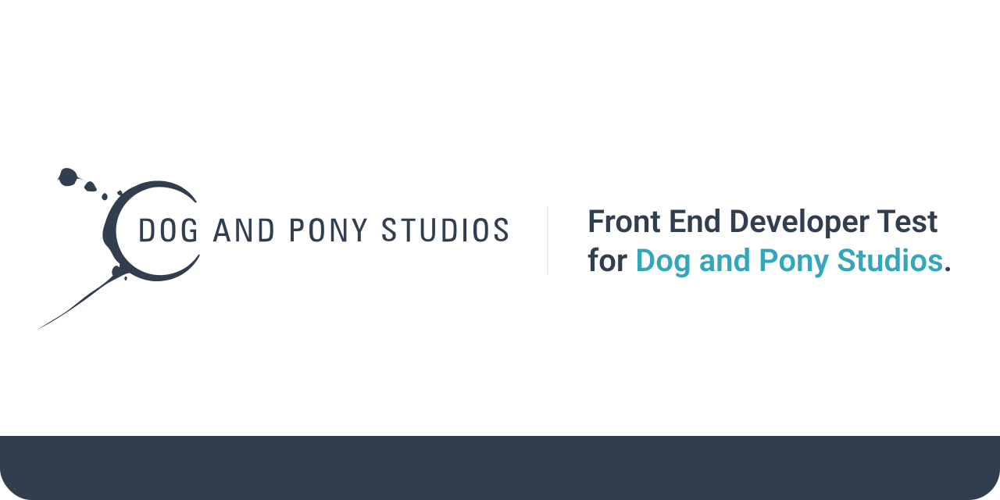

<p align="center">
   
  <br />
</p>
<p align="center">
  <a href="https://github.com/micheldslive/dog-and-pony-challenge#about-">About</a> •  
  <a href="https://github.com/micheldslive/dog-and-pony-challenge#techs-">Techs</a> •  
  <a href="https://github.com/micheldslive/dog-and-pony-challenge#getting-started-">Getting started</a> •  
  <a href="https://dog-and-pony.mi-code.dev/" target="_blank">Live demo</a> •
  <a href="https://dog-and-pony-book.mi-code.dev/" target="_blank">Book Live demo</a>
</p>

## About 💻

Project made for Dog and Pony Studios front end challenge.

## Libs 🚀

The project was developed with following libraries:

- **[Next.js](https://nextjs.org)** is the React Web Framework of choice
- Styling with **[TailwindCSS](https://tailwindcss.com)**
- **[Radix UI](https://www.radix-ui.com)** accessible and customizable library
- **[Storybook](https://storybook.js.org/)** to create a domented app library
- **[React Hook Form](https://react-hook-form.com)** to deal with forms
- Modern State Manager with **[Zustand](https://github.com/pmndrs/zustand)**
- Linting with **[Eslint](https://eslint.org)**
- Code formatting with **[Prettier](https://prettier.io)**
- Git hook with **[Husky](https://github.com/typicode/husky)**
- **[Lint Staged](https://github.com/okonet/lint-staged)** to check staged files before commits
- Automated workflow to production with **[GitHub Actions](https://github.com/features/actions)**
- Static Types with **[Typescript](https://www.typescriptlang.org)**
- Runtime schema validation with **[Zod](https://zod.dev)**
- Generate new components with **[plop](https://plopjs.com/)**

## Getting Started 📦

Clone this repository in your local machine:

```bash
git clone https://github.com/micheldslive/dog-and-pony-challenge.git
```

Then move to the project directory

```bash
cd dog-and-pony-challenge
```

Install the project dependencies:

```bash
pnpm i
# or
yarn
```

Run the application locally and open up [local host](http://localhost:3000)

```bash
pnpm dev
# or
yarn dev
```

With Docker properly installed and the repository Cloned, Run the command below:

```bash
docker compose up
```

The main components of the application were documented. To access them in their locale, run the following command:

```bash
pnpm storybook
# or
yarn storybook
```

## Developer 💻<br>

<table>
  <tr>
    <td align="center">
      <a href="https://github.com/micheldslive">
        <br>
        <sub>
          <b>Michel Domingos</b>
        </sub>
      </a>
    </td>
  </tr>
</table>

## 🖊️ License

This project is licensed under the MIT License - see the LICENSE page for details.
